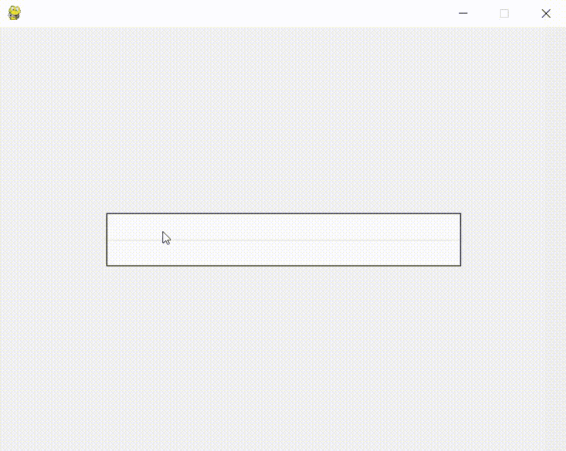

# pinyin2hanzi_python
 词、句拼音转汉字、拼音分割、pygame输入中文

split_pinyin.py实现的是拼音分割，输出结果包括完美分割、可补全、其他三类，借鉴了[这里](https://blog.csdn.net/songrps/article/details/103591422/)的代码。

```python
from split_pinyin import get_split_py

match, completion, other = get_split_py('jintiantianqizenmeyang')
[print(m) for m in match]

# ['jin', 'tian', 'tian', 'qi', 'zen', 'me', 'yang']
# ['jin', 'ti', 'an', 'tian', 'qi', 'zen', 'me', 'yang']
# ['jin', 'tian', 'ti', 'an', 'qi', 'zen', 'me', 'yang']
# ['jin', 'ti', 'an', 'ti', 'an', 'qi', 'zen', 'me', 'yang']
```

pinyin2hanzi.py实现的是词、句拼音转汉字，基于[Pinyin2Hanzi](https://github.com/letiantian/Pinyin2Hanzi)。

```python
from pinyin2hanzi import Pinyin2Hanzi

pred = Pinyin2Hanzi().py2hz('tianqihenhao')
[print(p) for p in pred]

# [['tian', 'qi', 'hen', 'hao'], (['天气', '很好'], -2.845650288926298), 0]
# [['tian', 'qi', 'hen', 'hao'], (['天启', '很好'], -2.966399834773926), 0]
# [['tian', 'qi', 'hen', 'hao'], (['天齐', '很好'], -2.967213606561925), 0]
# [['tian', 'qi', 'hen', 'hao'], (['田七', '很好'], -2.967341566004625), 0]
```

text_box.py是在此基础上用pygame实现的简易文本输入框，参考了[这里](https://blog.csdn.net/qq_39687901/article/details/104684429)的实现。

